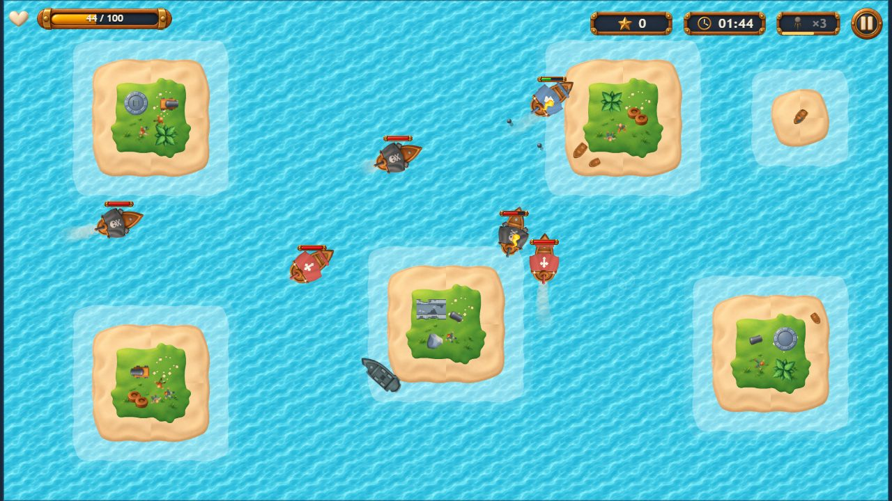
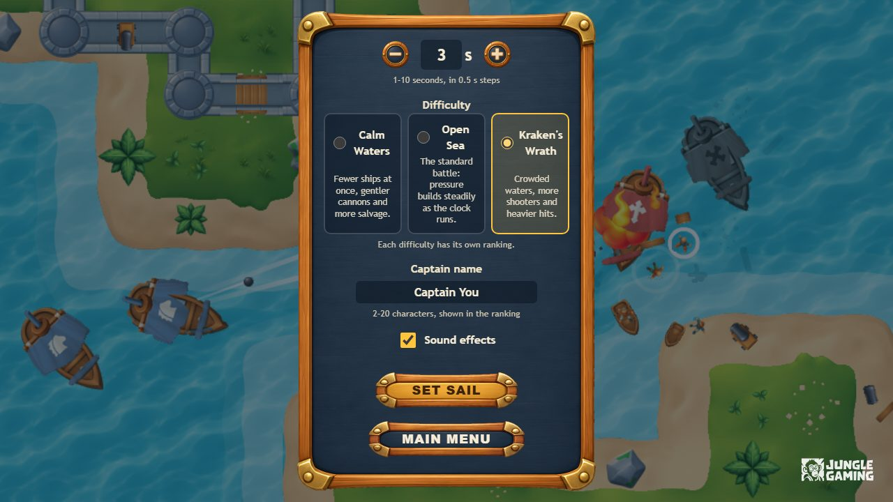
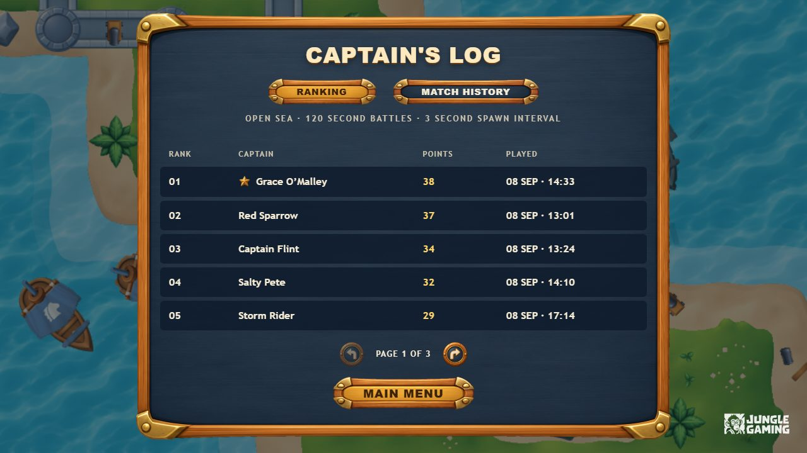
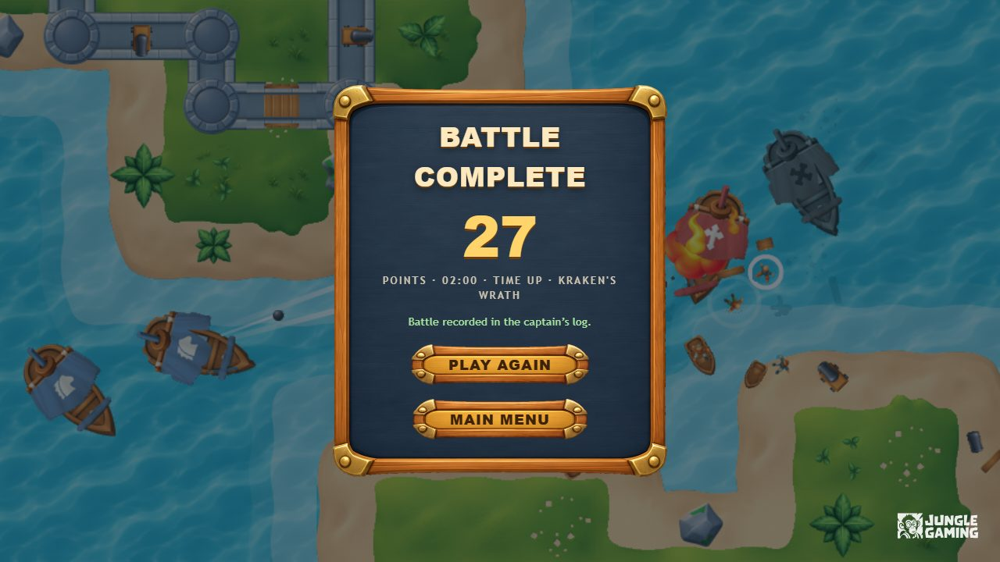
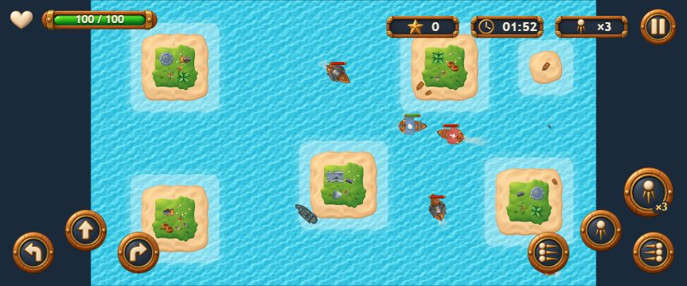

<div align="center">

# Pirate Battle

**A top-down naval shooter built with React, TypeScript and PixiJS.**
Sail between islands, sink chasers and shooters, salvage your hull and climb the captain's log before the timer runs out.

[](https://github.com/kaiquethomaz/game-developer-challenge/actions/workflows/ci.yml)


**[Play the live demo](https://pirate-battle.pages.dev)** · [Architecture](ARCHITECTURE.md) · [Performance report](docs/performance/PROFILE.md) · [Test reports](docs/reports/README.md)



</div>

## Highlights

- **Pure, deterministic simulation.** Fixed 1/60 s timestep, seeded randomness and no Pixi, React or DOM in the rules, so every battle can be replayed and unit tested.
- **Smart enemies.** Chasers ram, shooters hold their range and aim with line of sight, and both steer around islands with a shared flow field.
- **Living sea.** Drifting water, foam wakes, swaying hulls, shadows under cannonballs, damage stages, explosions and hand-placed pirate camps on every island, all from the provided art.
- **More than the brief.** A triple volley on a long reload, repair salvage from sunk ships, enemy pressure that ramps over the match and three difficulties with separate rankings.
- **Resilient captain's log.** Idempotent match registration, a persisted pending queue, cancelled stale requests and 14 reproducible network scenarios served by MSW, also in production.
- **Accessible on every screen.** Keyboard and multi-touch controls, managed focus in dialogs, a polite live region for the battle and reduced motion support.
- **Tested and measured.** 80 unit tests, 110 Playwright tests on desktop and mobile with per platform visual baselines, CI on every push and a 60 FPS profile with memory checks.

<table>
  <tr>
    <td width="50%"><p align="center"><b>Prepare for battle</b>: duration, spawn interval, difficulty and captain name</p></td>
    <td width="50%"><p align="center"><b>Captain's log</b>: ranking per configuration and match history</p></td>
  </tr>
  <tr>
    <td width="50%"><p align="center"><b>Result</b>: score, time played, end reason and registration status</p></td>
    <td width="50%"><p align="center"><b>Mobile</b>: landscape layout with multi-touch controls</p></td>
  </tr>
</table>

## Contents

- [Tech stack](#tech-stack)
- [Setup](#setup)
- [Commands](#commands)
- [Controls](#controls)
- [Gameplay configuration](#gameplay-configuration)
- [Network scenarios](#network-scenarios)
- [Testing](#testing)
- [Performance](#performance)
- [Deployment](#deployment)
- [Assets and licenses](#assets-and-licenses)

## Tech stack

| Concern                             | Technology                                                                    |
| ----------------------------------- | ----------------------------------------------------------------------------- |
| Menus, forms, HUD, dialogs          | React 19                                                                      |
| Language                            | TypeScript (strict, `exactOptionalPropertyTypes`, `noUncheckedIndexedAccess`) |
| Arena, ships, projectiles, effects  | PixiJS 8                                                                      |
| Ranking and match history state     | TanStack Query 5                                                              |
| HTTP client                         | Axios                                                                         |
| Mock REST API (dev, tests and prod) | MSW 2                                                                         |
| End-to-end and visual tests         | Playwright                                                                    |
| Unit tests for the simulation       | Vitest                                                                        |
| Build                               | Vite 8                                                                        |

Architecture and design decisions are documented in [ARCHITECTURE.md](ARCHITECTURE.md).

## Setup

Requirements: Node.js 22.12 or newer (developed with Node 24) and npm.

```bash
npm ci
npx playwright install chromium
npm run dev
```

The dev server runs on <http://localhost:5173>. No backend or private service is needed: the ranking and history API is served by MSW inside the browser, also in the production build.

### Environment variables

None. The app is fully static. Everything that varies at runtime is controlled through the URL parameters described below.

## Commands

| Command                          | Description                                                        |
| -------------------------------- | ------------------------------------------------------------------ |
| `npm run dev`                    | Vite dev server with React Strict Mode                             |
| `npm run build`                  | Type check and production build into `dist/`                       |
| `npm run preview`                | Serve the production build on <http://localhost:4173>              |
| `npm run lint`                   | ESLint with type-aware rules                                       |
| `npm run typecheck`              | TypeScript project references, no emit                             |
| `npm run format`                 | Prettier                                                           |
| `npm test`                       | Vitest unit tests for the simulation, storage, API and mocks       |
| `npm run test:e2e`               | Playwright suite on desktop and mobile Chromium (builds first)     |
| `npm run test:e2e:ui`            | Playwright UI mode                                                 |
| `npm run test:e2e:update`        | Regenerate the visual regression baselines                         |
| `npm run test:e2e:docker`        | Run the Playwright suite in the official Linux container (any OS)  |
| `npm run test:e2e:docker:update` | Regenerate the Linux baselines in that container                   |
| `npm run test:e2e:report`        | Open the last HTML report (traces are kept for failed tests)       |
| `npm run profile`                | Production build plus a 3 minute profiling match and memory cycles |
| `npm run profile:heap`           | Heap snapshot comparison by V8 node type across battle cycles      |
| `npm run atlas`                  | Regenerate the Pixi atlases from the provided sprite sheets        |

## Controls

| Action                 | Keyboard           | Touch (landscape)                    |
| ---------------------- | ------------------ | ------------------------------------ |
| Sail forward           | `W` or `↑`         | Forward button, left side            |
| Turn left / right      | `A` `D` or `←` `→` | Turn buttons, left side              |
| Front cannon           | `Space` or `J`     | Center button, right side            |
| Left / right broadside | `Q` / `E`          | Side buttons, right side             |
| Triple volley          | `R` or `K`         | ×3 button, above the right broadside |
| Pause                  | `Esc` or `P`       | Pause button in the HUD              |

The **triple volley** is a special shot: three balls fanned around the bow, on a 6 second reload shown by the ×3 gauge in the HUD. The front cannon itself always fires a single ball.

Sink enemies to score. Sunk ships may leave floating **repair salvage** (a green glow with planks): sail over it with a damaged hull to repair 20 health. Salvage drops more often when your hull is at half health or less, and it sinks after 12 seconds.

Keys can be held together, so you can sail, turn and fire at the same time. Touch buttons are multi-touch. Game keys are only captured while a battle is running; they are released in menus, dialogs and form fields. On phones the game is played in landscape; portrait shows a rotate hint.

## Gameplay configuration

All balancing lives in a single typed object, `DEFAULT_GAME_CONFIG` in [`src/game/config.ts`](src/game/config.ts): arena and islands, spawn timing and distribution, health, movement and turn speeds, weapon damage, cooldowns, projectile speed, range and lifetime, and the shooter's attack and preferred range. It also holds the enemy pressure ramp (the cap of enemies alive grows from 4 to 10 and shooters become more common as the match goes on) and the repair salvage drops. Systems never hard-code gameplay numbers.

**Play** opens a **Prepare for battle** screen with the same form as Options, so the duration, spawn interval, difficulty and captain name can be checked right before sailing; **Set sail** validates, saves and starts the battle. **Play again** on the result screen restarts at once with the saved settings.

The Options screen exposes two values, validated and persisted in `localStorage`:

| Option            | Range    | Step  | Default |
| ----------------- | -------- | ----- | ------- |
| Game session time | 60–180 s | 1 s   | 120 s   |
| Enemy spawn time  | 1–10 s   | 0.5 s | 3 s     |

It also offers a **difficulty**. Presets live next to the balance in `DIFFICULTY_PRESETS` and never change the two options above:

| Difficulty     | Enemies alive (start → end) | Late mix, chasers / shooters | Enemy damage | Salvage chance |
| -------------- | --------------------------- | ---------------------------- | ------------ | -------------- |
| Calm Waters    | 3 → 6                       | 55 / 45                      | ×0.75        | ×1.4           |
| Open Sea       | 4 → 10                      | 40 / 60                      | ×1           | ×1             |
| Kraken's Wrath | 6 → 14                      | 30 / 70                      | ×1.3         | ×0.8           |

The difficulty is part of the match configuration: it is stored with every record, and the ranking only compares battles played with the same duration, spawn interval and difficulty. Records saved before difficulties existed are read as Open Sea.

Each match takes a snapshot of the options when it starts (`createMatchConfig`), so changing them mid-battle only affects the next one. The Options screen also stores the captain name shown in the ranking and a sound toggle.

## Network scenarios

The mock API supports reproducible scenarios. Pick one from the gear button on the main menu (**Network scenarios**) or with URL parameters, which are persisted until reset:

| Parameter  | Values                                                                                                                                                                                                             |
| ---------- | ------------------------------------------------------------------------------------------------------------------------------------------------------------------------------------------------------------------ |
| `scenario` | `success`, `empty`, `many-pages`, `slow`, `variable-latency`, `out-of-order`, `timeout`, `network-error`, `server-error`, `client-error`, `ranking-error`, `history-error`, `record-timeout`, `record-unavailable` |
| `latency`  | Base latency in milliseconds for normal scenarios (default `250`)                                                                                                                                                  |
| `mockSeed` | Seed for the variable latency scenario                                                                                                                                                                             |

**Reset:** use **Reset mock data** in the Network scenarios dialog. It clears every match recorded by the mock server and restores the `success` scenario. Pending local submissions are kept on purpose so recovery can be exercised.

### Reproducing failures

| Goal                                         | How                                                                                   |
| -------------------------------------------- | ------------------------------------------------------------------------------------- |
| Loading and background updates               | `/?scenario=slow`, open Ranking                                                       |
| Empty lists                                  | `/?scenario=empty`                                                                    |
| Pagination                                   | `/?scenario=many-pages`                                                               |
| Late answers that must not overwrite data    | `/?scenario=out-of-order`, page back and forth in Ranking                             |
| Ranking or history failures                  | `/?scenario=ranking-error` or `/?scenario=history-error`                              |
| Timeout, connection failure, 4xx and 5xx     | `/?scenario=timeout`, `network-error`, `client-error`, `server-error`                 |
| Timeout after the server stored a match      | `/?scenario=record-timeout`, finish a battle: the retry recovers the stored record    |
| API down when the battle ends, then recovery | `/?scenario=record-unavailable`, finish a battle, refresh, switch to `success`, retry |
| Asset loading failure                        | Block `assets/atlas/ships.json` in the browser dev tools, then press **Try again**    |

## Testing

```bash
npm test
npm run test:e2e
```

The Playwright suite runs against the production build (`vite preview`) on two projects: **desktop Chromium** (1280×720) and **mobile Chromium** (Pixel 7 landscape). It covers the twelve areas listed in the challenge, including visual regression baselines for the menu, a stable arena and the result screen in `tests/e2e/__screenshots__/`. Reports from the last full run are versioned in [docs/reports](docs/reports/README.md). The HTML report is written to `playwright-report/`, and traces and videos are kept for failed tests in `test-results/`.

Determinism comes from an opt-in probe enabled with `?e2e=1`:

| Parameter        | Effect                                                                        |
| ---------------- | ----------------------------------------------------------------------------- |
| `seed=<n>`       | Seeds enemy spawns and placement                                              |
| `clock=manual`   | The simulation only advances through `window.__pirateBattle.advance(seconds)` |
| `invulnerable=1` | Profiling only: the player takes no damage, every other rule is unchanged     |

The probe also exposes read-only state through `window.__pirateBattle.getState()`. Combat tests still press the real keyboard and touch controls, and every test starts from a fresh browser context.

Font rendering differs between operating systems, so visual baselines are versioned per platform in `tests/e2e/__screenshots__/{win32,linux}`. Linux baselines come from the official Playwright Docker image, which CI uses too. On Windows, `npm run test:e2e` matches the baselines as is. On Linux and macOS, run `npm run test:e2e:docker`, which only needs Docker and reproduces CI exactly. A plain `npm run test:e2e` on macOS skips the three visual tests and runs the rest of the suite.

### Continuous integration

[`.github/workflows/ci.yml`](.github/workflows/ci.yml) runs on every push and pull request: lint, type checks, formatting, unit tests and the production build, then the full Playwright suite inside the Playwright container. The HTML report is uploaded as an artifact on every run, and traces and videos on failure. The manual **Visual baselines** workflow regenerates the Linux baselines in the same container and publishes them as an artifact, for hosts where Docker is not available.

## Performance

`npm run profile` builds the app, plays a 3 minute match with a scripted captain and runs five start, play and exit cycles. The latest results, with hardware, browser, resolution, configuration and limitations, are in [docs/performance/PROFILE.md](docs/performance/PROFILE.md).

## Deployment

**Live demo:** <https://pirate-battle.pages.dev>, deployed on Cloudflare Pages from `main`.

The app is a static Vite build (build command `npm run build`, output directory `dist`) and runs on any static host:

- **Cloudflare Pages:** create a Pages project connected to the repository with the Vite preset. The Node version comes from `.nvmrc`, and `public/_headers` keeps the mock service worker uncached and caches the game assets.
- **Vercel:** import the repository with the default Vite preset. `vercel.json` applies the same cache rules.

Keeping the mock service worker uncached lets new deployments pick up handler changes. The mock API runs in the deployed build, so the game works when opening or reloading the public URL.

## Assets and licenses

The art and sound pack provided with the challenge lives in `public/assets/`. Sources and licenses are listed in [docs/ASSETS.md](docs/ASSETS.md).
